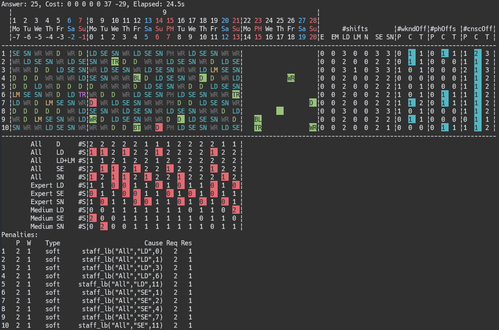

# An ASP-Based NSP Solver for Yamanashi Instances

This repository provides encodings and a solver for the Nurse Scheduling Problem
(NSP) at Yamanashi University Hospital, based on Answer Set Programming (ASP).
The repository includes two types of instances: real-world and artificial.

- The real-world instances are anonymized datasets derived from the nurse
  scheduling challenges faced at Yamanashi University Hospital.
- The artificial instances are designed for testing and benchmarking purposes
  and include scripts for generating customizable problem scenarios.

## Table of Contents
- [Requirements](#requirements)
- [NSP Instances](#nsp-instances)
  - [Real Instances](#real-instances)
  - [Artificaial Instances](#artificial-instances)
- [NSP Solving](#nsp-solving)
  - [Using `nspsolver.py`](#using-nspsolverpy)
  - [Solving Directly with Clingo](#solving-directly-with-clingo)
- [NSP Encoding](#nsp-encoding)
- [License](#license)

## Requirements

To use this solver, ensure the following dependencies are installed:

- **Python**: Version 3.7 or higher
- **Clingo**: Version 5.7.1 or higher
- **Python Packages**:
  - `colorama`
  - `Faker`
  - `jpholiday`
  - `pandas`

<br>

# NSP Instances

## Real Instances

The nurse scheduling problem at Yamanashi University Hospital is to determe
28-day shift schedules for each nurse.  The shifts are categorized into four
types: 8 work shifts, 2 rest shifts, 3 business shifts, and 10 leave shifts. The
details are summarized in the table below:

| Work shifts | Description   | Rest shifts | Description |Business shifts | Description |Leave shifts | Description |
| ---: | --- | ---: | --- | ---: | --- | ---: | --- |
| **D**  | Day                | **WR** | Weekly rest      | **BT** | Business trip       | **AL** | Annual leave       |
| **LD** | Long day           | **PH** | Public holiday   | **TR** | Training            | **BL** | Bereavement leave  |
| **EM** | Early morning      |        |                  | **HC** | Health check        | **HL** | Health leave       |
| **LM** | Late morning       |        |                  |        |                     | **ML** | Maternity leave    |
| **E**  | Evening            |        |                  |        |                     | **NL** | Nursing leave      |
| **SE** | Short evening      |        |                  |        |                     | **PL** | Parental leave     |
| **N**  | Night              |        |                  |        |                     | **SL** | Sick leave         |
| **SN** | Short night        |        |                  |        |                     | **SP** | Special leave      |
|        |                    |        |                  |        |                     | **VL** | Volunteer leave    |
|        |                    |        |                  |        |                     | **WL** | Wedding leave      |

**Work shifts** and **rest shifts** are the primary focus of the automatic
schedule generation process, while business shifts and leave shifts are assigned
based on nurses' requests.

The [/real-instances](/real-instances) directory contains anonymized datasets
derived from various nursing departments at Yamanashi University Hospital. The
file names for these NSP instances follow the format `YYYY-MM-DD-XXX.lp`, where
- `YYYY-MM-DD` represents the start date of the schedule.
- `XXX` is an abbreviation for the department name.

These files are designed to include the following files located in the
`YYYY-MM-DD-XXX` directory and the [/encoding/real](/encoding/real) directory.

- `date.lp`
    - This file defines the dates used in NSP. The shift table spans 28 days (4
      weeks) and includes one week from the end of the previous month and one
      week from the beginning of the following month to ensure consistency with
      adjacent shifts. Additionally, past dates are included to promote fairness
      in shift burden.

    - Dates are provided in two formats: Gregorian calendar dates as integers in
      the `YYYYMMDD` format and relative values, where the start date of the
      schedule is represented as 0.

    - Five predicates (`base_date`, `prev_date`, `date`, `next_date`,
      `past_date`) are used to represent dates. Their relationships are
      illustrated below:
        - The starting date of the `date` predicates is YYYY-MM-DD.
        - The starting date of the `past_date` predicates depends on the
          specific NSP instance.

    ```mermaid
    gantt
        dateFormat YYYY-MM-DD
        section Period
            past_date      :2024-07-30, 2024-08-18
            base_date (6w) :2024-08-11, 42d
            prev_date (1w) :2024-08-11, 7d
            date (4w)      :28d
            next_date (1w) :7d
    ```

- `past-shifs.lp`
  - This file represents past shift data corresponding to the previously
    mentioned `past_date`. It is used to promote fairness in shift burdens, such
    as equalizing the number of weekend days off.

- `requested-shifts.lp`

  - This file represents the requested shifts of each nurse. Due to the
    requirements of the system used at the university hospital, requested shifts
    are defined using the `shift_data/4` predicate. These are converted into
    `pos_request(N, D, S)` by [encoding/nsp-prepro.lp](encoding/nsp-prepro.lp),
    where `N` denotes a nurse, `D` a day, and `S` a shift. In our NSP, requested
    shifts are treated as *hard constraints*.

  - In the real instances within this repository, at most one `pos_request` is
    defined per nurse per day. This limitation is due to the export
    functionality of the system used at the university hospital. However, in
    practice, multiple requests can exist, such as `pos_request(N, D, S1), ...,
    pos_request(N, D, Sn)`, and one of these requested shifts must be assigned.
    Conversely, dispreferred shifts can be represented using the `neg_request(N,
    D, S)` predicate, which can also be declared multiple times. These
    predicates indicate that none of the specified dispreferred shifts should be
    assigned.

- `setting.lp`
  - This file defines various settings for the department, including:
    - **Nurses and Nurse Groups**:
      - Lists nurses and their group affiliations.
    - **Shift Groups**:
      - Defines shift group settings:
      - Unlike general NSPs, our NSP introduces the concept of shift groups. For
        example, the day shift consists of two types: `D` (regular day shift)
        and `LD` (long day shift). Constraints, such as requiring at least 10
        nurses for either `D` or `LD`, are applied.
    - **Day-by-Day Shift Assignment Bounds**:
      - Specifies upper and lower bounds for the required number of staff based
        on the day of the week, nurse group, and shift (or shift group).
    - **Nurse-by-Nurse Shift Assignment Bounds**:
      - Specifies upper and lower bounds for the number of times each nurse can
        be assigned to specific shifts.
    - **Workday and Shift Constraints**:
      - Defines the maximum number of consecutive workdays allowed for each group.
      - Specifies inter-shift constraints (e.g., only evening shifts are allowed
        before a night shift).
      - Lists forbidden shift patterns.
      - Includes upper and lower bounds for shift pattern assignments for each
        group.
  - Constraints that define upper and lower bounds are often expressed using two
    types: *hard bounds* and *soft bounds*. Hard bounds represent ranges that
    must be strictly satisfied, while soft bounds represent ranges that should
    ideally be satisfied as much as possible. Typically, the relationship is as
    follows:

      ```
      |------------------------ Mandatory Range -------------------------|
      |               |---------- Ideal Range ----------|                |
      Hard Lower      Soft Lower               Soft Upper       Hard Upper
    ```

- `/encoding/real/nsp-XXX.lp`
  - This file defines department-specific constraints as well as the priorities
    of both department-specific and non-department-specific constraints.
  - In our NSP, the objective function minimizes the weighted violations of soft
    constraints. The minimization is performed in lexicographic order based on
    the priority levels.
  - Soft constraint priorities range from 1 to 9. If the NSP is unsatisfiable,
    hard constraints are relaxed into soft constraints and solved again. In this
    case, the priority of the relaxed hard constraints is increased by 9 from
    the corresponding soft constraint priority, resulting in hard constraint
    priorities ranging from 10 to 19.

Real-world instances tend to be unsatisfiable. This is primarily because shift
assignments based on nurses' requests (`pos_request/3`) can sometimes violate
hard constraints. For example, `pos_request/3` may require six consecutive
workdays, even though the limit is five. As a result, it is often necessary to
relax hard constraints to generate a shift schedules.

## Artificial Instances

The artificial instances, located in the [`/gen-instances`](/gen-instances/) directory, are designed
to reflect typical constraints observed in real-world cases from our university
hospital while varying both the number of nurses and the scheduling period. This
variation allows for a range of problem sizes, from smaller test cases to
instances comparable in size to real datasets.

All artificial instances have a start date of **2025-09-08**. This date was
chosen specifically because public holidays fall during the second and third
weeks of September, enabling validation of the constraints related to public
holidays.

All artificial instances were generated using the script `gennsp.py`. Since the
generated NSP instances do not include past shift data, an additional NSP
instance is created to generate the previous schedule. This previous schedule is
then solved using Clingo for a fixed time limit to produce past shift data. This
process is automated using the shell script:
`gen-instances/make-instances-with-past-shifts.sh`. The random seed is fixed,
ensuring that the same instances are generated consistently across multiple
runs.

### Parameter Variations in Artificial Instances

The artificial instances were generated by varying the following parameters:

- **Number of Nurses:** 5, 10, 20, 40
- **Number of Days:** 7, 14, 28
- **Staff Request Rate:** 0.00, 0.10
- **Recommended Pairs:**
   - For nurses < 20: 0 pairs
   - For nurses ≥ 20: 0 and 2 pairs
- **Forbidden Pairs:**
   - For nurses < 20: 0 pairs
   - For nurses ≥ 20: 0 and 2 pairs
- **Start Date:** Set to **2025-09-08**

### Naming Convention for Generated Instances

The generated instances are stored using the following naming convention:

```plaintext
nsp-n<NURSES>-d<DAYS>-r<STAFF_REQUEST>-rp<RECOMMENDED_PAIRS>-fp<FORBIDDEN_PAIRS>.lp
```
where:
- `NURSES`: Number of nurses
- `DAYS`: Number of days in the schedule
- `STAFF_REQUEST`: Staff request rate
- `RECOMMENDED_PAIRS`: Number of recommended pairs
- `FORBIDDEN_PAIRS`: Number of forbidden pairs

<br>

# NSP Solving

## Using `nspsolver.py`

`nspsolver.py` is a script for solving NSP instances. If the given NSP instance
is unsatisfiable, `nspsolver.py` automatically relaxes hard constraints into
soft constraints and solves the problem again (internally by defining the
predicate `soften_hard` and retrying). The script runs Clingo internally. Any
options not directly supported by `nspsolver.py` are passed to Clingo. For
example, specifying the -t 4 option enables solving with four threads in
parallel.

**Typical Usage**
```shell
./nspsolver.py nsp.lp /path/to/nsp-instance.lp -s
```
`nsp.lp` is the ASP encoding for NSP. The `-s` option generates and displays a
shift table each time a model is found.

Below is an example of the shift table output.



**Cell Background Colors**
- Red background: Indicates a constraint violation.
- Light blue background: Represents a rewarded condition.
- Green background: Indicates the presence of either a positive or negative request from a nurse.

**Top-Right Section**
- `#shifts`: The number of assignments for each shift during the current month.
- `#wkndOffs`: The number of weekend days off, categorized as `P` (past), `C`
  (current month), and `T` (total).
- `#phOffs`: The number of public holiday days off assigned.
- `#cnscOffs`: The number of consecutive weekly rest days assigned.

**Center-Left Section**
- The first column lists the nurse groups: `All`, `Expert`, and `Medium`.
- The adjacent column represents shifts (or groups of shifts).
- Example: `All D #S` indicates the number of staff members from the `All` group
  assigned to shift `D`. If it represents a point instead of a quantity, it is
  denoted as `#P`.

**Penalties**
- Penalties are displayed in order of priority, starting from the highest. The
  following abbreviations are used:
    - `P`: Priority
    - `W`: Weight
    - `Type`: Indicates whether the penalty is soft or hard
    - `Cause`: Reason for the violation
    - `Req`: Expected value
    - `Res`: Actual value

### Displaying Models on Demand

If the `nspsolver.py` script outputs many models, the output may scroll quickly,
making it difficult to follow. The `nspsolver.py` script writes each model to
the file `found-model.lp` (or a file specified with the `-o` option) as it is
found, with only the latest model being retained. The model file can be
displayed using the `showmodel.py` script. This allows you to run `nspsolver.py`
on one terminal and use another terminal to monitor the latest model using
`showmodel.py`.
```shell
./nspsolver.py nsp.lp /path/to/nsp-instance.lp  # Run in one terminal
./showmodel.py                                  # Run in another terminal
```
To view models as Clingo finds them, use the `-f` option of `showmodel.py`. This
checks the model file for updates and displays the latest model every second
(the check interval can be adjusted by specifying an argument for the -f
option).

### Resuming Search After Interruption

Even if the execution of `nsp-solver.py` is interrupted (e.g., by pressing
`Ctrl+C`),  you can efficiently resume the search by using the -i option along
with `nsp-prioritize.lp`.  This approach assigns priority to the predicates with
assignments recorded in the found-model.lp file, effectively reproducing those
assignments and allowing the search to continue from where it left off.

```shell
./nspsolver.py nsp.lp /path/to/nsp-instance.lp
Ctrl+C detected! Stopping Clingo...

./nspsolver.py nsp.lp encoding/nsp-prioritize.lp /path/to/nsp-instance.lp -i
```

## Solving Directly with Clingo
For users familiar with Clingo, you can directly solve an NSP instance as follows:

```shell
clingo nsp.lp cli.lp /path/to/nsp-instance.lp > nsp.log
```

`cli.lp` includes Python scripts (`nsp-prepro-helper.lp`) for pre-processing and
introduces the constant `soften_hard_on` to control the relaxation of hard
constraints. By default, hard constraints are enabled. If you specify `-c
soften_hard_on=1` in Clingo's command line arguments, the hard constraints will
be relaxed into soft constraints.

```shell
clingo nsp.lp cli.lp /path/to/nsp-instance.lp -c soften_hard_on=1 > nsp.log
```

`showmodel.py` constructs and displays a shift table from the last model in the
log file.

```shell
./showmodel.py nsp.log
```
To view models as Clingo finds them, use the -f option of showmodel.py. This
checks the model file for updates and displays the latest model every second
(the check interval can be adjusted by specifying an argument for the -f
option).

### Resuming Search After Interruption

Even if the execution of Clingo is interrupted (e.g., by pressing `Ctrl+C`), you
can effectively resume the search by reusing the last model. The script
`make_legacy_model.py` extracts the last model from the log file and saves it as
`legacy-model.lp`. Afterward, you can use Clingo with the `nsp-prioritize.lp`
and `legacy-model.lp` files and the `--heuristic=Domain` option. This setup
prioritizes and reproduces the assigned predicates contained in the
`legacy-model.lp` file, allowing you to continue the search to some extent.

```shell
clingo nsp.lp cli.lp /path/to/nsp-instance.lp > nsp.log
[Ctrl+C pressed]

./make_legacy_model.py nsp.log -o legacy-model.lp
clingo nsp.lp cli.lp encoding/nsp-prioritize.lp /path/to/nsp-instance.lp legacy-model.lp --heuristic=Domain > nsp.log
```

<br>

# NSP Encoding

The file **[`nsp.lp`](./nsp.lp)** serves as the ASP encoding for the Nurse Scheduling Problem (NSP). It includes the following component files:

- **[`nsp-prepro.lp`](./encoding/nsp-prepro.lp)**:
  - Handles preprocessing tasks and prepares data before solving the NSP.
- **[`nsp-encoding.lp`](./encoding/nsp-encoding.lp)**:
  - Further includes a modular set of constraint files, detailed below.

## Modular Constraint Files

The ASP encoding is divided into modular files, each focusing on a specific type
of constraint. These files are structured to support the **individual addition**
of constraints, enabling better control and flexibility during testing and
evaluation.

However, the file **[`nsp-01-basic.lp`](./encoding/nsp-01-basic.lp)** is always
required as it contains the core definitions necessary for the optimization
problem, including auxiliary predicates, output predicates, and the objective
function.

- **[`nsp-01-basic.lp`](./encoding/nsp-01-basic.lp)**
  Core constraints for NSP, including:
  - Ensures lower and upper bounds on the number of workdays.
  - Ensures lower and upper bounds on weekly rest days.
  - Definitions for auxiliary predicates, output predicates, and the objective function.

- **[`nsp-02-day-by-day.lp`](./encoding/nsp-02-day-by-day.lp)**
  Defines constraints on day-by-day shift assignments:
  - Enforces lower and upper limits on the number of shifts assigned per nurse per day.

- **[`nsp-03-nurse-by-nurse.lp`](./encoding/nsp-03-nurse-by-nurse.lp)**
  Specifies constraints for shift assignments per nurse:
  - Ensures lower and upper limits on each nurse's individual workload.

- **[`nsp-04-consecutive-days.lp`](./encoding/nsp-04-consecutive-days.lp)**
  Imposes constraints on consecutive working days:
  - Restricts specific sequences of workdays to prevent excessive workloads.

- **[`nsp-05-requested-shifts.lp`](./encoding/nsp-05-requested-shifts.lp)**
  Handles constraints on requested shifts:
  - Satisfies nurses' preferences or mandatory shift requests.

- **[`nsp-06-shift-patterns.lp`](./encoding/nsp-06-shift-patterns.lp)**
  Manages constraints on shift patterns:
  - Defines lower and upper limits on the number of occurrences of specific shift patterns.
  - Specifies shift patterns that are not allowed.

- **[`nsp-07-inter-shifts.lp`](./encoding/nsp-07-inter-shifts.lp)**
  Defines constraints on inter-shift relationships:
  - Specifies and enforces allowable transitions between consecutive shifts.

- **[`nsp-08-nurse-pairs.lp`](./encoding/nsp-08-nurse-pairs.lp)**
  Specifies constraints for nurse pair assignments:
  - Defines preferred nurse pairs for night shifts.
  - Specifies nurse pairs that cannot work together during night shifts.

- **[`nsp-09-isolated-days.lp`](./encoding/nsp-09-isolated-days.lp)**
  Prevents isolated work days:
  - Ensures that workdays are not unnecessarily surrounded by days off.

- **[`nsp-10-leave-with-rest.lp`](./encoding/nsp-10-leave-with-rest.lp)**
  Handles constraints for leave days with weekly rest:
  - Assigns weekly rest days before and/or after the requested leave period if possible.

- **[`nsp-11-equal-distribution.lp`](./encoding/nsp-11-equal-distribution.lp)**
  Enforces constraints for equal shift distribution:
  - Balances workloads fairly among nurses to promote equity.

### How to Use These Files

The file **[`nsp.lp`](./nsp.lp)** includes all constraints for NSP. The file
**[`nsp-basic-only.lp`](./nsp-basic-only.lp)** includes only the core
constraints from [`nsp-01-basic.lp`](./encoding/nsp-01-basic.lp) along with
preprocessing ([`nsp-prepro.lp`](./encoding/nsp-prepro.lp)).

If you want to add constraints selectively, start with
**[`nsp-basic-only.lp`](./nsp-basic-only.lp)** and include additional constraint
files as needed.

#### Example: Adding day-by-day and nurse-by-nurse Constraints
The following example combines the basic constraints with day-by-day and
nurse-by-nurse constraints:

```bash
./nspsolver.py nsp-basic-only.lp encoding/nsp-0[23]-* /path/to/nsp-instance.lp
```
- [`nsp-basic-only.lp`](./nsp-basic-only.lp): Core constraints only.
- [`encoding/nsp-02-day-by-day.lp`](./encoding/nsp-02-day-by-day.lp): Adds day-by-day constraints.
- [`encoding/nsp-03-nurse-by-nurse.lp`](encoding/nsp-03-nurse-by-nurse.lp): Adds nurse-by-nurse constraints.

You can further extend this by including other modular constraints as needed.

<br>

# License

This project is licensed under the **Creative Commons Attribution-NonCommercial 4.0 International (CC BY-NC 4.0)** License.
You are free to use, share, and adapt this work for **non-commercial academic purposes only**, as long as you give appropriate credit.

For more details, see the [LICENSE](./LICENSE) file or visit the [Creative Commons website](https://creativecommons.org/licenses/by-nc/4.0/).
